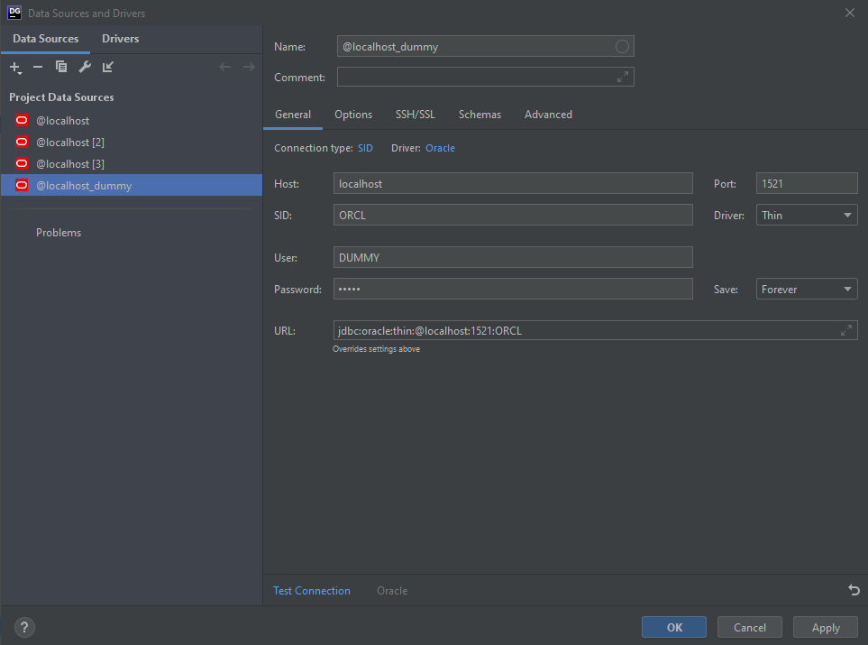

# **`dockerize oracle`**
 
Using oracle database is just painful. This is a template repo to spin up oracle database container.

# **Creating the docker image**

first git clone this repository


navigate to `dockerfiles/<version>` . Download the binary of your desired oracle database version and put it there . The binaries can be downloaded from the [Oracle Technology Network](www.oracle.com/technetwork/database/enterprise-edition/downloads/index.html), make sure you use the linux link: `Linux x86-64`. The needed file is named `linuxx64_<version>_database.zip`.

Now go to `dockerfiles` and run the `buildContainerImage.sh` script

```bash
[oracle@localhost dockerfiles]$ ./buildContainerImage.sh -h

Usage: buildContainerImage.sh -v [version] -t [image_name:tag] [-e | -s | -x] [-i] [-o] [container build option]
Builds a container image for Oracle Database.

Parameters:
   -v: version to build
       Choose one of: 11.2.0.2  12.1.0.2  12.2.0.1  18.3.0  18.4.0  19.3.0  
   -t: image_name:tag for the generated docker image
   -e: creates image based on 'Enterprise Edition'
   -s: creates image based on 'Standard Edition 2'
   -x: creates image based on 'Express Edition'
   -i: ignores the MD5 checksums
   -o: passes on container build option

* select one edition only: -e, -s, or -x

LICENSE UPL 1.0

Copyright (c) 2014,2021 Oracle and/or its affiliates.
```

Here is an example usage using 19.3.0

```bash
./buildDockerImage.sh -v 19.3.0 -s
```

Sit back and relax while the freakin big database is being installed.

The resulting images will be an image with the Oracle binaries installed. On first startup of the container a new database will be created, the following lines highlight when the database is ready to be used:

```bash
#########################
DATABASE IS READY TO USE!
#########################
```

You may extend the image with your own `Dockerfile` and create the users and tablespaces that you may need.

After the image is successfully created, if you run `docker images` command, you will find the image

```bash
REPOSITORY                         TAG          IMAGE ID       CREATED              SIZE
oracle/database                    19.3.0-se2   9c70f41e1126   2 days ago           6.53GB
```

# **Spinning up oracle database in a container**

To run your Oracle Database image use the `docker run` command as follows:

```bash
docker run --name <container name> \
-p <host port>:1521 -p <host port>:5500 \
-e ORACLE_SID=<your SID> \
-e ORACLE_PDB=<your PDB name> \
-e ORACLE_PWD=<your database passwords> \
-e INIT_SGA_SIZE=<your database SGA memory in MB> \
-e INIT_PGA_SIZE=<your database PGA memory in MB> \
-e ORACLE_EDITION=<your database edition> \
-e ORACLE_CHARACTERSET=<your character set> \
-e ENABLE_ARCHIVELOG=true \
-v [<host mount point>:]/opt/oracle/oradata \
oracle/database:19.3.0-ee

Parameters:
   --name:        The name of the container (default: auto generated).
   -p:            The port mapping of the host port to the container port.
                  Two ports are exposed: 1521 (Oracle Listener), 5500 (OEM Express).
   -e ORACLE_SID: The Oracle Database SID that should be used (default: ORCLCDB).
   -e ORACLE_PDB: The Oracle Database PDB name that should be used (default: ORCLPDB1).
   -e ORACLE_PWD: The Oracle Database SYS, SYSTEM and PDB_ADMIN password (default: auto generated).
   -e INIT_SGA_SIZE:
                  The total memory in MB that should be used for all SGA components (optional).
                  Supported 19.3 onwards.
   -e INIT_PGA_SIZE:
                  The target aggregate PGA memory in MB that should be used for all server processes attached to the instance (optional).
                  Supported 19.3 onwards.
   -e ORACLE_EDITION:
                  The Oracle Database Edition (enterprise/standard).
                  Supported 19.3 onwards.
   -e ORACLE_CHARACTERSET:
                  The character set to use when creating the database (default: AL32UTF8).
   -e ENABLE_ARCHIVELOG:
                  To enable archive log mode when creating the database (default: false).
                  Supported 19.3 onwards.
   -v /opt/oracle/oradata
                  The data volume to use for the database.
                  Has to be writable by the Unix "oracle" (uid: 54321) user inside the container!
                  If omitted the database will not be persisted over container recreation.
   -v /opt/oracle/scripts/startup | /docker-entrypoint-initdb.d/startup
                  Optional: A volume with custom scripts to be run after database startup.
   -v /opt/oracle/scripts/setup | /docker-entrypoint-initdb.d/setup
                  Optional: A volume with custom scripts to be run after database setup.
                 
```

Here is an example usage

```bash
docker run --name new_oracle19c \
 -p 1521:1521 -p 5500:5500 \
 --shm-size=1g \
 -e ORACLE_SID=ORCL \
 -e ORACLE_PDB=ORCLPDB1 \
 -e ORACLE_PWD=oracle \
 -v /d/Work/oracle_docker_test/sql:/docker-entrypoint-initdb.d/startup \
 -v /d/Work/oracle_docker_test/sql:/docker-entrypoint-initdb.d/setup \
 -d oracle/database:19.3.0-se2
```

Sit back and relax while the freakin big database is being installed. (2)

## Important notes

- if you already have another oracle database locally installed or running in a container that uses the port `1521`, change the `-p` to `1522:1521`
- don't use `ORACLE_SID=orcl`. `ORACLE_SID` is case sensitive

# **Accessing database through `sqlplus`**

run the terminal

```bash
docker exec -it container_id bash
```

then

```bash
sqlplus system as sysdba
```

when prompted for password, give the password when you ran the container

```bash
password : oracle
```

Now, you can access the oracle database

Let's create a new user

## **Creating new user (Process 1)**

```bash
create user DUMMY identified by DUMMY;
GRANT ALL PRIVILEGES TO DUMMY;
```

## **Creating new user (Process 2)**

```bash
CREATE TABLESPACE DUMMY_TABSPACE
DATAFILE 'dummy_tabspace.dat'
SIZE 10M AUTOEXTEND ON;

CREATE TEMPORARY TABLESPACE DUMMY_TABSPACE_TEMP
TEMPFILE 'dummy_tabspace_temp.dat'
SIZE 5M AUTOEXTEND ON;

CREATE USER DUMMY
IDENTIFIED BY DUMMY
DEFAULT TABLESPACE DUMMY_TABSPACE
TEMPORARY TABLESPACE DUMMY_TABSPACE_TEMP;

GRANT CONNECT,RESOURCE,DBA TO DUMMY;
GRANT CREATE SESSION TO DUMMY;
GRANT CREATE TABLE TO DUMMY;
GRANT UNLIMITED TABLESPACE TO DUMMY;
```

# **Accessing database through `Datagrip`**

File > new > Data Source > Oracle



Now click `test connection` and if all goes well you will see a green prompt saying the connection was successful : ) Click apply and you will find your newly created user with schema

## Note

If you have used `-p 1522:1521` , then just use `1522` instead `1521` in the port section
